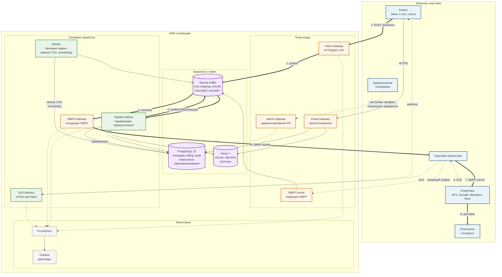
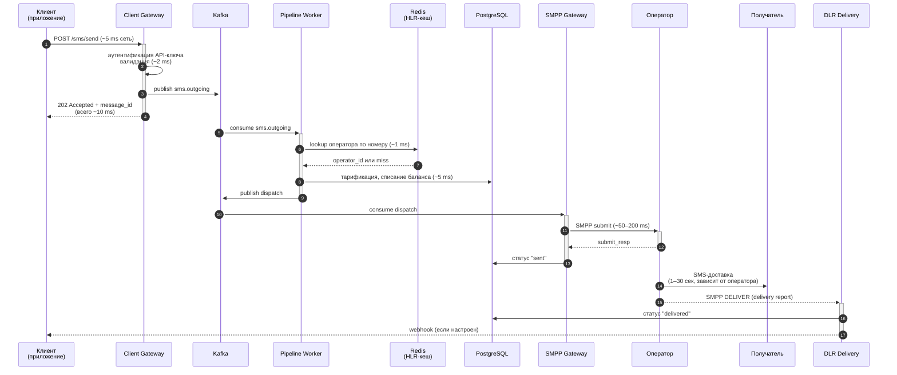

# Архитектура SMS-платформы — техническое приложение

Этот документ — техническое приложение к инвесторской презентации. Содержит две схемы: **карту межсервисного взаимодействия** (C4-Container уровень) и **последовательность обработки одного сообщения** (sequence-диаграмма с временными бюджетами).

Схемы описаны на языке [Mermaid](https://mermaid.js.org/) — текстовом формате, который автоматически рендерится в SVG. Открыть схемы можно:
- В VS Code с расширением Mermaid Preview
- На [mermaid.live](https://mermaid.live/) — вставить блок кода и получить рендер
- В GitHub-просмотрщике markdown — рендеринг встроенный

---

## 1. Карта межсервисного взаимодействия

Полная схема платформы со всеми ключевыми компонентами и потоками данных. Жирные стрелки — happy-path рассылки сообщения; тонкие — вспомогательные потоки (аудит, метрики, биллинг); пунктир — административная плоскость.

### Что показывает схема

- **Точки входа** разделены: трафик клиентского API, портала и админки физически не пересекаются. Это безопасность и изоляция нагрузки.
- **Kafka — центральный буфер**: все асинхронные потоки идут через неё. При сбое любого worker'а сообщения копятся в очереди и обрабатываются после восстановления — без потерь.
- **Postgres** хранит транзакционные данные с помесячным партиционированием (messages, audit_log, deliveries, lookup_log) — это позволяет архивировать старые данные без остановки сервиса.
- **Redis** разгружает Postgres на горячих запросах: пользовательские сессии, rate-limiting, HLR-кеш.
- **Prometheus + Grafana** — независимая плоскость наблюдения, не зависящая от работоспособности самого продукта.

---

## 2. Жизнь одного сообщения

Sequence-диаграмма показывает, что физически происходит за время от вызова API клиентом до получения SMS на телефоне. Цифры в миллисекундах — типовые бюджеты при текущей нагрузке 1200 msg/sec.

### Бюджет времени

| Этап | Типовое время | Что определяет |
|---|---|---|
| Приём + валидация + ack клиенту | ~10 мс | Наш код, контролируемо |
| Тарификация + маршрутизация | ~5–10 мс | Наш код, контролируемо |
| Передача SMPP оператору | ~50–200 мс | Сеть до оператора |
| Доставка SMS оператором | 1–30 сек | Оператор, не контролируем |
| Возврат DLR | 1–30 сек после доставки | Оператор |

**Главный вывод:** на долю нашей платформы приходится менее 5% общего времени доставки. Все остальное — операторы и сеть. Это означает, что для роста производительности нет смысла оптимизировать дальше внутренний код — нужно масштабировать SMPP-сессии и работать над контрактами с операторами.

---

## 3. Масштабируемость: где узкие места и как их обходить

| Уровень | Текущая мощность | Узкое место | План при 10× росте |
|---|---|---|---|
| Client Gateway (API) | ~5 000 RPS на узел | CPU на JSON-парсинге | Горизонтально: 2-3 узла за load-balancer |
| Pipeline Worker | ~1 200 msg/sec на узел | I/O в Postgres | 5-6 узлов worker'ов, читают из Kafka параллельно |
| SMPP Gateway | ~500 msg/sec на SMPP-сессию | Лимит оператора на сессию | Несколько сессий на оператора, балансировка между ними |
| PostgreSQL | ~3 000 write/sec | Запись в WAL | Read-replicas для аналитики, логическая репликация. Дальше — шардинг по client_id |
| Kafka | Десятки тысяч msg/sec | Disk I/O брокера | Кластер из 3 брокеров, репликация |
| Redis | Сотни тысяч op/sec | Сеть | Redis Cluster при необходимости |

При горизонте 50 000 msg/sec (2-3 года) ключевое архитектурное изменение — перевод на Kubernetes с автоматическим масштабированием по нагрузке и развёртывание в нескольких ЦОДах для гео-резервирования.
